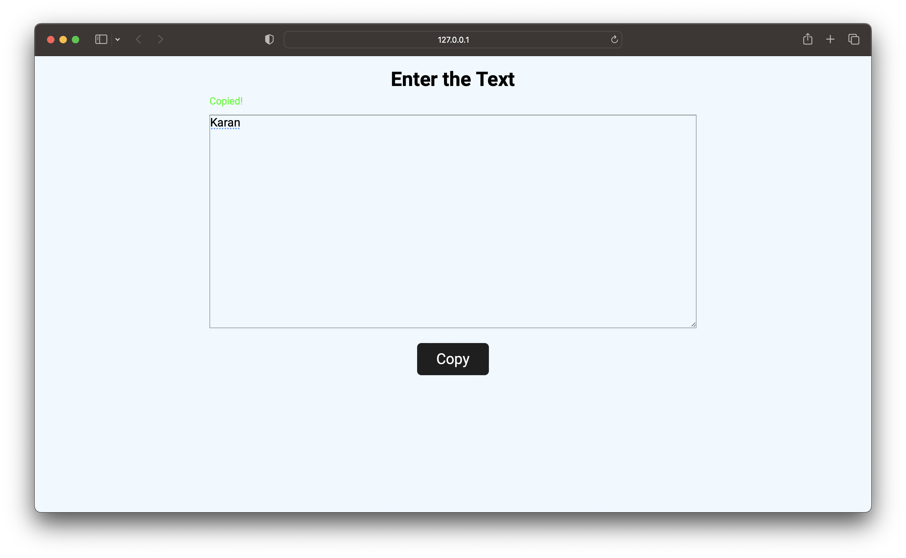

### Copy to Clipboard using vanila Javascript

>In this project, a input field is given and on pressing the Copy button the input text is copied to the clipboard.


## live link - [click here](https://clipboard-js-karanch.netlify.app)

## Time taken - 1hrs

## New topic learned
```
navigator.clipboard.writeText()
```

### Screenshots 


